# Argentum Online — Documentación Técnica

**Taller de Programación I — FIUBA — 1er Cuatrimestre 2026 — Grupo 09**

Nicolás de la Torre, Oliver Weber, Joaquín Velurtas, Tomás Nahuel Olivera.

---

## Cliente

El cliente es la aplicación gráfica (SDL2/SDL2pp) con la que el jugador entra al juego. Se ocupa de tres cosas: las pantallas previas (login y creación de personaje), el render del mundo en tiempo real y la traducción del input del usuario en mensajes del protocolo. La parte de red (los dos hilos de I/O, las colas y `ClientProtocol`) está descripta en [Capa de comunicación del cliente](#capa-de-comunicación-del-cliente). Este apartado se encarga de explicar las pantallas y el renderizado.

### Organización

El `Client` arma la conexión y orquesta el arranque: corre las pantallas previas una por una, hace el handshake con el server y, recién cuando tiene el spawn y el mapa, levanta los hilos de I/O y entra a `GameScreen`. Totalmente abstraido de la comunicacion, solamente manejandose con eventos.

`GameScreen` es el corazón del cliente y corre el game loop  **input → update → render** a ~60 FPS. Mantiene todo el estado visual del mundo y lo dibuja delegando en `MapRenderer`, que sabe traducir cada entidad a sprites. El estado se actualiza de dos fuentes: el input local (con **predicción**: el cliente mueve su sprite sin esperar al server) y los `ServerEvent`s que llegan por la cola, que son la verdad autoritativa.

### Componentes

- **`Client`**: orquesta el ciclo de vida. Abre la conexión, corre las pantallas previas, hace el handshake, levanta `ClientSender`/`ClientReceiver` y lanza `GameScreen`. 
- **`LoginScreen`**: primera pantalla. Captura el nombre de usuario y devuelve un `LoginResult`.
- **`CharacterCreationScreen`**: si el server responde `FIRST_LOGIN`, elige raza y clase en dos fases.
- **`HeadSelectionScreen`**: Luego de la eleccion de raza y clase, entra a esta pantalla donde elige la cabeza de su personaje para una mayor personalizacón.
- **`GameScreen`**: pantalla principal de juego. Corre el game loop (input/update/render), mantiene el estado del mundo, aplica predicción local y reconciliación, y construye los `ClientEvent`s que van a la cola de salida para la comunicacion con el servidor.
- **`MapRenderer`**: GameScreen delega el dibujo en esta clase. Tiles del piso, obstáculos, jugadores (cuerpo + cabeza + arma + escudo + casco), NPCs, items en el piso, sangre y proyectiles.
- **`TextureCache`**: cachea las texturas por nombre de archivo.
- **`SoundManager`**: música de fondo en loop y efectos de sonido.
- **`GameMap` / `TileData` / `MapObstacle`**: modelo en memoria del mapa que recibe el cliente en el evento `MAP`.

### Pantallas y ciclo de vida

`Client` posee la conexión y los hilos de I/O, y corre las pantallas previas en orden antes de entrar al juego. Cada pantalla previa expone un `run()` bloqueante que devuelve su resultado (`confirmed=false` si el usuario cancela).

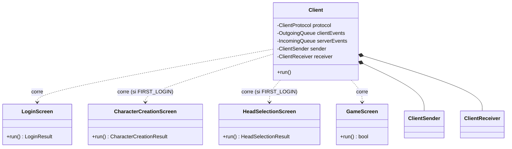

### Pantalla de juego y render

`GameScreen` concentra el estado del mundo y delega todo el dibujo en `MapRenderer`, que a su vez resuelve las texturas con `TextureCache`. Los sonidos pasan por `SoundManager`. La entrada y salida de mensajes son las dos colas compartidas con los hilos de I/O.

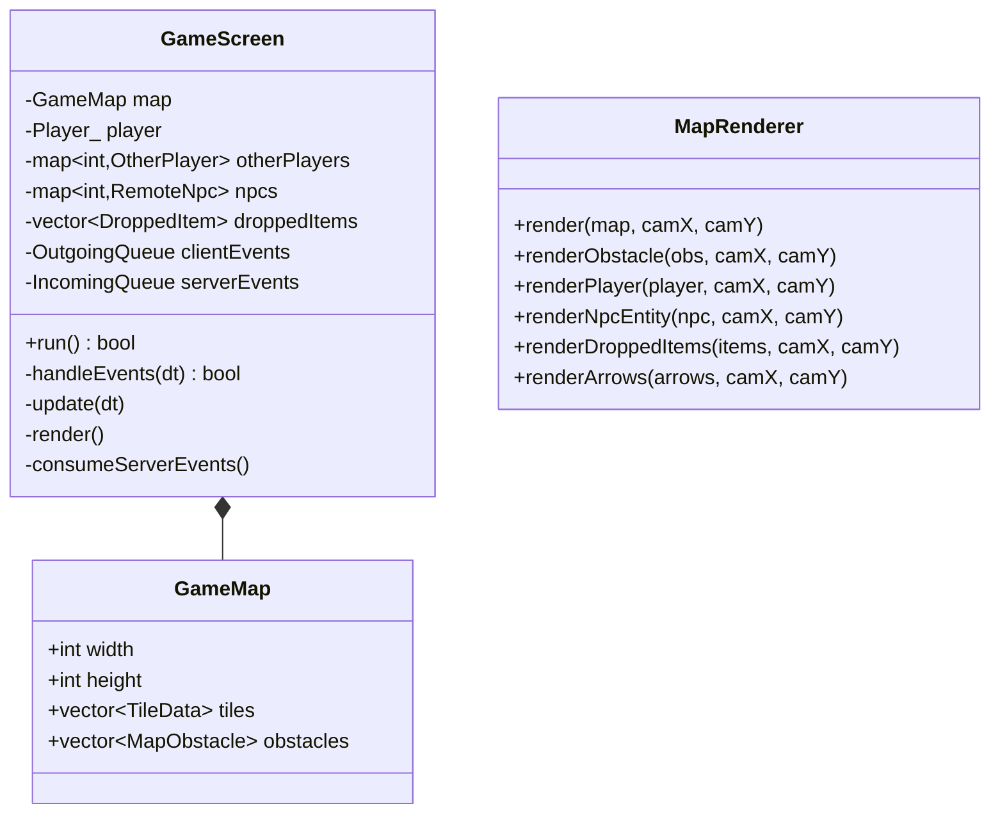

### Flujo de arranque (handshake + entrada al juego)

El handshake es en dos fases: primero solo se manda el nombre. Si el jugador ya existe, el server contesta `LOGIN_OK` directo; si es nuevo, manda `FIRST_LOGIN` y el cliente corre creación + selección de cabeza antes de mandar `CHARACTER_CREATED`. Recién después de `LOGIN_OK` + `MAP` se levantan los hilos de I/O y se entra a `GameScreen`.

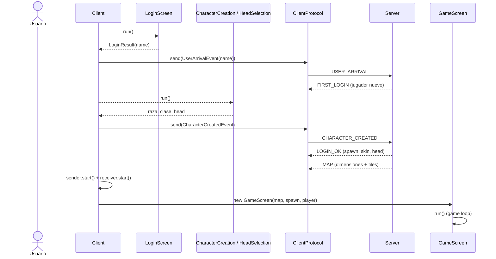

### Game loop de un frame

Cada frame de `GameScreen` repite **input → update → render**. El input local mueve el sprite por predicción y empuja `ClientEvent`s a la cola saliente; el update drena los `ServerEvent`s que dejó el receiver y reconcilia el estado (por ejemplo, ante un `MOVE_REJECTED` "snapea" a la posición autoritativa).

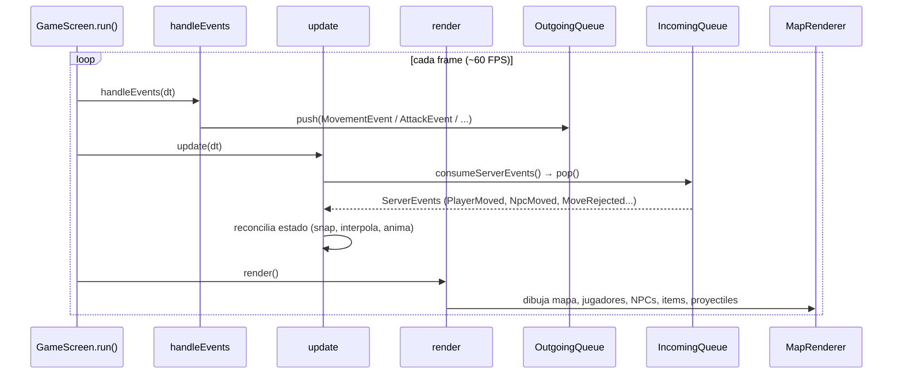

## Servidor

## Servidor

### 1. Representación del Mapa y el Entorno
El mundo del juego se divide en dos entornos principales: el **Overworld** (mundo abierto) y la **Dungeon** (mazmorra). Cada posición en el escenario se modela mediante la estructura `Cell`, la cual almacena sus coordenadas `(x, y)` junto con los atributos requeridos para validar la colisión y transitabilidad de las entidades.

Una entidad se puede posicionar en una `Cell` si cumple con lo siguiente:
- No hay ningún obstáculo encima.
- No hay ninguna entidad encima (se guarda el ID de la entidad para identificar si está ocupada la `Cell` o no). Los fantasmas (jugadores muertos) cuentan como entidad posicionada en una `Cell`.
- La entidad está en proceso de resurrección (solo aplica esto hacia los jugadores).

La clase `Map` gestiona el escenario completo a través de un vector unidimensional de objetos `Cell`. Para optimizar el acceso a la información de una coordenada específica, se transforma la posición bidimensional a un índice lineal mediante la siguiente ecuación de indexación:

`índice = y * width + x`

### 2. Diseño de los Atributos
Un jugador posee los siguientes atributos (en algunos se incluye la fórmula para calcularlo):
- Nivel
- Experiencia
- Constitución
- Inteligencia
- Fuerza
- Agilidad
- FRazaVida
- FRazaMana
- FRazaRecuperacion
- FClaseVida
- FClaseMana
- FClaseMeditacion
- Vida Máxima (Constitución * FClaseVida * FRazaVida * Nivel)
- Maná Máxima (Inteligencia * FClaseMana * FRazaMana * Nivel)
- Oro Máximo Seguro (100 * Nivel^1.1)

La única información visible que tiene el jugador es el nivel, experiencia actual, vida actual, maná actual y oro actual. Las criaturas poseen algunos de estos atributos, los cuales son: Vida Máxima y Agilidad.

Desde el atributo Constitución hasta FClaseMeditacion, su valor depende de la raza y clase elegida. Se pueden elegir 4 razas distintas:
- Humano
- Elfo
- Enano
- Gnomo

Y se pueden elegir 4 clases distintas:
- Mago
- Clérigo
- Paladín/Campeón
- Guerrero

Para los jugadores que seleccionen la clase Guerrero, todos los atributos relacionados a la magia serán anulados.

Si los jugadores son asesinados, pierden todas sus cosas y la posibilidad de realizar la mayoría de acciones, ya que para el juego son jugadores muertos. Las únicas acciones que pueden realizar son trucos (no recomendable, alto riesgo de romper el juego) y mensajes (ya sean públicos o respecto al clan). Para resucitar, deben escribir el comando `/resucitar`, el cual durante unos segundos los teletransportará al sacerdote más cercano, apareciendo con toda su salud y maná a la máxima capacidad.

### 3. Ciclo de Juego y Gestión de Turnos
El flujo de la partida se administra mediante un **bucle de juego (Game Loop)** continuo que procesa las acciones en un orden secuencial estricto:
1. **Peticiones de los Jugadores:** Se extraen de forma continua las solicitudes enviadas por los clientes y se despachan las instrucciones correspondientes a la clase maestra `Game`.
2. **Acciones Pasivas:** Se actualizan los estados temporales de los jugadores, tales como la regeneración de salud y maná (incluida el maná regenerado a través de la *meditación*), o los contadores de tiempo para la resurrección.
3. **Turno de los NPCs:** Se procesa la lógica de las entidades no jugables. Esto incluye rutinas de persecución, ejecución de ataques a jugadores dentro del rango o tiempos de reaparición (*respawn*).

### 4. Sistema Económico
La moneda del juego es el *oro*. Cada jugador tendrá una cantidad segura de oro, lo cual quiere decir que no va a perder esa cantidad al ser asesinado, y una cantidad en exceso. El exceso es la cantidad de oro que el jugador va a perder si es asesinado, que sería como máximo un 50% de la cantidad máxima de oro seguro.

Las criaturas también tienen oro y lo pueden dejar caer tras ser eliminadas. La cantidad de oro está determinada por esta ecuación:

`rand(0, 0.2) * VidaMaxNPC`

De los tres NPCs pasivos (comerciante, sacerdote y banquero), el único que puede tener oro es el banquero, pero lo guarda en la cuenta del respectivo jugador y se mantendrá constante durante el tiempo, aunque el servidor esté inactivo, hasta que el jugador quiera retirar esa cantidad. El sistema bancario permite depositar y retirar desde cualquier sucursal en el mundo. Con respecto al comerciante y al sacerdote, a pesar de que se utiliza el oro como moneda de intercambio, internamente no tienen ningún depósito de oro. Por lo tanto, pueden comprar una cantidad infinita de ítems.

### 5. Administración del Inventario
Todos los jugadores poseen un inventario con capacidad máxima de 20 ranuras. En esas ranuras pueden almacenar todos los ítems existentes del juego (exceptuando el oro, el cual se coloca en su ranura específica), los cuales pueden conseguir a través de compras, encontrándolos en el suelo o con el uso de trucos.

Todos los ítems pueden ser equipados, pudiendo equipar a la vez estos 4 tipos:
- Arma (ya sea ofensiva/sanadora o cuerpo a cuerpo/a distancia)
- Casco
- Armadura (Torso superior e inferior)
- Escudo

Las pociones, al ser equipadas, se consumen automáticamente aplicando el efecto correspondiente.

Si el jugador es asesinado, todos los ítems del inventario caen al suelo, teniendo la posibilidad de ser robados por otros jugadores o de desaparecer tras el cierre del servidor.

### 6. Sistema de Niveles
Todos los jugadores y todas las criaturas poseen un número que determina su nivel. Cuanto mayor es el nivel, mayores son sus estadísticas base como la vida, el maná (solo para los jugadores no guerreros) y el daño (solo para las criaturas).

Con respecto a los jugadores, el límite para alcanzar el próximo nivel está determinado por la siguiente ecuación:

`1000 * Nivel^1.8`

Para poder alcanzar ese límite y subir de nivel, se debe atacar a una criatura o a otro jugador no aliado permitido. La experiencia obtenida se basa en esta ecuación:

`Daño * max(NivelDelOtro - Nivel + 10, 0)`

Si se logra matar a la entidad, se recibe una cantidad de experiencia extra determinada por esta ecuación:

`rand(0, 0.1) * VidaMaxDelOtro * max(NivelDelOtro - Nivel + 10, 0)`

El jugador no pierde experiencia tras ser asesinado.

### 7. Jerarquía de Entidades
El sistema de personajes y criaturas se organiza mediante clases que separan los datos lógicos de su comportamiento:
- **Jugadores:** Representados por la clase `Player`. Esta actúa como la clase maestra que expone los métodos de acción del personaje y encapsula una estructura interna llamada `PlayerData`, encargada exclusivamente de almacenar los datos que requieren persistencia.
- **Enemigos y NPCs:** La clase `NPC` define el comportamiento base de los personajes no jugables. Los NPCs pasivos se configuran como entidades estáticas para garantizar que los usuarios conozcan su ubicación en todo momento. Por otro lado, los NPCs agresivos se modelan mediante la clase derivada `Creature`, la cual hereda de `NPC` e implementa capacidades ofensivas y de combate.

### 8. Sistema de Ítems y Atributos
Las estadísticas base de los personajes se determinan a partir de la combinación de su raza y clase. Tanto estos valores iniciales como las propiedades de todos los ítems del juego se parametrizan en un **archivo de constantes de configuración en formato TOML**. La lógica del juego lee este archivo para calcular las ecuaciones de combate y atributos en tiempo de ejecución, transformando los datos estáticos en eventos dinámicos dentro del entorno.

### 9. Movimiento e Inteligencia Artificial (IA) de NPCs
Las criaturas hostiles (`Creature`) poseen una lógica de persecución básica determinada por un **rango de proximidad**:
- Los NPCs pasivos permanecen inmóviles.
- Las criaturas agresivas activan su rutina de movimiento cuando detectan a un jugador vivo en un radio de 3 celdas en cualquier dirección. La IA fija como objetivo al primer jugador válido detectado dentro de este rango y comienza la persecución.

Las criaturas solo aparecen en los biomas del Overworld o en las Dungeon, y cada uno de estos lugares posee una cantidad limitada de criaturas que pueden aparecer en el entorno. Si una criatura muere, con el tiempo va a revivir y aparecer en alguna posición aleatoria del entorno.

Las criaturas al morir pueden dejar caer algunos objetos, los cuales son los siguientes junto a sus probabilidades:
- 0.80 Nada
- 0.08 Oro, una cantidad igual a `rand(0.01, 0.2) * VidaMaxNPC`
- 0.01 Una poción de vida o maná elegida al azar
- 0.01 Cualquier otro objeto al azar

Tipos de criaturas que existen en el juego:
- Goblin
- Esqueleto
- Zombie
- Araña
- Orco
- Golem

### 10. Sistema de Combate
Los jugadores tienen dos formas de atacar a criaturas o a otros jugadores:
- **Cuerpo a Cuerpo:** Siempre se debe estar al lado de la víctima, incluyendo las posiciones diagonales, y se puede emplear con cualquier tipo de ítem ofensivo.
- **A Distancia:** Se puede atacar a una entidad dentro de un rango de radio 3, pero solo con una cantidad de ítems específicos limitados los cuales permiten atacar a distancia.

Los jugadores pueden atacar a cualquier criatura sin ningún tipo de limitación, excluyendo cuando están muertos o si no tienen el maná suficiente para emplear el hechizo en cuestión. Con respecto al ataque hacia otros jugadores, solo se puede aplicar el ataque si la víctima no pertenece al mismo clan que el atacante, no es un jugador *newbie*, la diferencia de niveles es menor a 10 y si el atacante no se encuentra en la ciudad (*safe zone*).

El daño realizado está determinado por esta ecuación:

`Fuerza * rand(DañoArmaMin, DañoArmaMax)`

El ataque realizado puede ser un golpe crítico.

Las entidades se pueden defender esquivando el ataque o recibiendo una menor cantidad de daño de la que deberían recibir. La evasión está determinada por esta ecuación:

`rand(0, 1) ^ Agilidad < 0.001`

Y la defensa está determinada por esta ecuación:

`rand(ArmaduraMin, ArmaduraMax) + rand(EscudoMin, EscudoMax) + rand(CascoMin, CascoMax)`

### 11. Ítems
En total hay 19 ítems diferentes los cuales pueden ser almacenados en el inventario y usados por el jugador. Los ítems son los siguientes:

1. **Armas ofensivas:**
- Espada
- Hacha
- Martillo
- Arco simple
- Arco compuesto

2. **Armas ofensivas mágicas:**
- Vara de fresno
- Báculo nudoso
- Báculo engarzado

3. **Armas curativas:**
- Flauta élfica

4. **Armaduras:**
- Armadura de cuero
- Armadura de placas
- Túnica azul

5. **Cascos:**
- Capucha
- Casco de hierro
- Sombrero mágico

6. **Escudos:**
- Escudo de tortuga
- Escudo de hierro

7. **Pociones:**
- Poción de Salud
- Poción de Maná

### 12. Sistema de Clanes
Un jugador de nivel 6 o más puede fundar un clan con nombre único. En el clan, otros jugadores se pueden unir, y si unos miembros del mismo clan se encuentran juntos, reciben bonificaciones de ataque y defensa.

### 13. Persistencia
Se utilizan en total 3 archivos binarios: 2 para los datos de los jugadores y uno para las cuentas bancarias de los jugadores.
- **Archivo 1:** Se guardan todos los nombres de los jugadores que una vez se conectaron al servidor y la posición (*offset*) donde se encuentran los datos de este mismo jugador en el Archivo 2.
- **Archivo 2:** Se guarda toda la información de un jugador que debe persistir. En esta información se incluye la ubicación, sus ítems, su oro, su salud máxima actual, su maná actual, nivel, experiencia, raza, clase, su equipamiento actual y si está vivo o muerto.
- **Archivo 3:** Se guarda el nombre del jugador y al lado la cantidad de oro y los ítems depositados.

### 14. Mini-Chat
Todos los jugadores pueden acceder al mini-chat del servidor, y acá pueden enviar mensajes, ejecutar comandos/trucos y ver los eventos que ocurren en su entorno.

Estos son todos los comandos que puede escribir un jugador:
- `/meditar`
- `/resucitar`
- `/curar` (se tiene que estar al lado de un sacerdote)
- `/depositar <objeto>` (se tiene que estar al lado de un banquero)
- `/retirar <objeto>` (se tiene que estar al lado de un banquero)
- `/listar` (se tiene que estar al lado de un sacerdote o comerciante)
- `/comprar <objeto>` (se tiene que estar al lado de un sacerdote o comerciante)
- `/vender <objeto>` (se tiene que estar al lado de un comerciante)
- `/tomar`
- `/tirar`
- `@<nick> <msj>`
- `/fundar-clan <nombre del clan>`
- `/unirse <nombre del clan>`
- `/revisar-clan`
- `/clan-aceptar <nick>`
- `/clan-rechazar <nick>`
- `/clan-ban <nick>`
- `/dejar-clan`
- `/clan-kick <nick>`

Estos son todos los trucos disponibles:
- `/levelup`
- `/item <número del ítem>`
- `/vidainf`
- `/manainf`
- `/suicidio`
- `/gold <cantidad>`

## Editor

El editor es la aplicacion que permite armar los mapas del juego personalizados y exportarlos como archivos YAML para que el servidor cargue.

### Organizacion

El núcleo de edición es una cadena: **`EditorWindow`** usa **`MapCanvas`**, y el canvas usa **`SceneController`** por dentro. Cada eslabón tiene una responsabilidad, la ventana orquesta, el canvas muestra y captura input, y el controlador de escena decide qué va en el mapa.

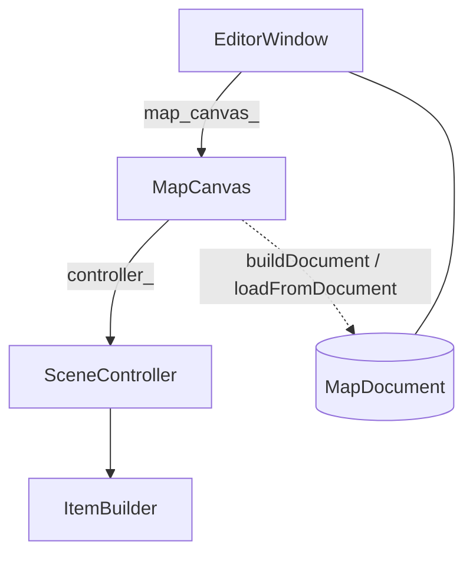

### Componentes

Los componentes se agrupan alrededor de esa cadena `EditorWindow → MapCanvas → SceneController`. 

- **`EditorWindow`**: ventana principal (`QMainWindow`). Es dueña del `MapDocument` completo y de la navegación entre el mapa principal y los environments. Arma la UI, carga los templates y delega la edición visual al `MapCanvas`. También tiene las operaciones que van más allá del canvas: crear o abrir mapas, redimensionar, guardar y verificar, y la creación de environments al colocar entradas.
- **`MapCanvas`**: área de edición visual. Muestra el mapa, captura el input del mouse y opera en uno de dos modos, `MainMap` o `Environment`. Traduce la interacción del usuario en llamadas a su `SceneController` interno y se encarga de lo visual: grilla, zoom, texturas de bioma y environments. Sincroniza el estado de la escena con un `MapDocument` y lo que requiere decisión de la ventana (guardar, crear un environment nuevo) lo comunica por señales.
- **`SceneController`**: capa de lógica de edición sobre la `QGraphicsScene`. Coloca y borra elementos del mapa (spawn, obstáculos, zonas, entradas, paredes, salidas, pisos), valida reglas según el tipo y consulta el `TemplateRegistry` para resolver templates. Genera IDs y delega la representación visual al `ItemBuilder`. Al serializar, recorre los ítems de la escena y arma un `MapDocument` con ciudades y sus NPCs, spawns de biomas y reconstruye el `BiomeGrid` usando Dijkstra.
- **`ItemBuilder`**: generador de `QGraphicsItem` usado por el controlador. Construye cómo se dibuja cada tipo de elemento (tamaño, textura, color, labels) y deja la metadata que el controlador necesita para persistirlo (tipo, id, template, tamaño, etc.). Separa la apariencia en pantalla de la estructura del `MapDocument`.
- **`MapDocument`**: modelo en memoria del mapa completo. Agrupa el overworld (dimensiones, spawn, obstáculos, zonas, entradas, `biome_grid`) y la lista de `Environment` con su contenido interno. Es la fuente de verdad que posee `EditorWindow`; el canvas y el controlador lo materializan o reconstruyen al sincronizar, y `YamlMapIO` lo persiste en disco.
- **`TemplateRegistry`**: catálogo de definiciones reutilizables (ciudades, biomas, obstáculos, entradas, paredes, salidas, pisos) cargadas desde `editor/assets/templates/`. La ventana lo usa para poblar el panel de herramientas; el canvas y el controlador lo consultan al colocar elementos o al resolver texturas y datos al serializar.
- **`YamlMapIO`**: capa de persistencia entre el editor y `server/assets/maps/`. Escribe y lee el mismo esquema YAML que consume el servidor, reconstruyendo un `MapDocument` editable al abrir un mapa.
- **`Verificator`**: reglas de consistencia que se aplican antes de guardar. Comprueba metadatos del mapa, spawn del jugador, que cada entrada apunte a un environment existente y, por environment, tamaño válido, spawn y que las paredes encierren un área interior donde pueda estar el spawn.
- **`BiomeGrid`**: auxiliares sobre el grid de celdas. `computeBiomeOwners` asigna cada celda al bioma más cercano (Dijkstra multi-fuente) y `computeExteriorCells` marca el exterior de un environment (flood fill).
- **`NewEnvironmentDialog` / `CreatureSpawnDialog`**: formularios para datos que no se obtienen de un click en el mapa. El primero pide el nombre de un environment nuevo y el segundo configura poblaciones de criaturas con sliders. La ventana los usa al crear o editar environments y el canvas, al definir o modificar los spawns de una zona de bioma.

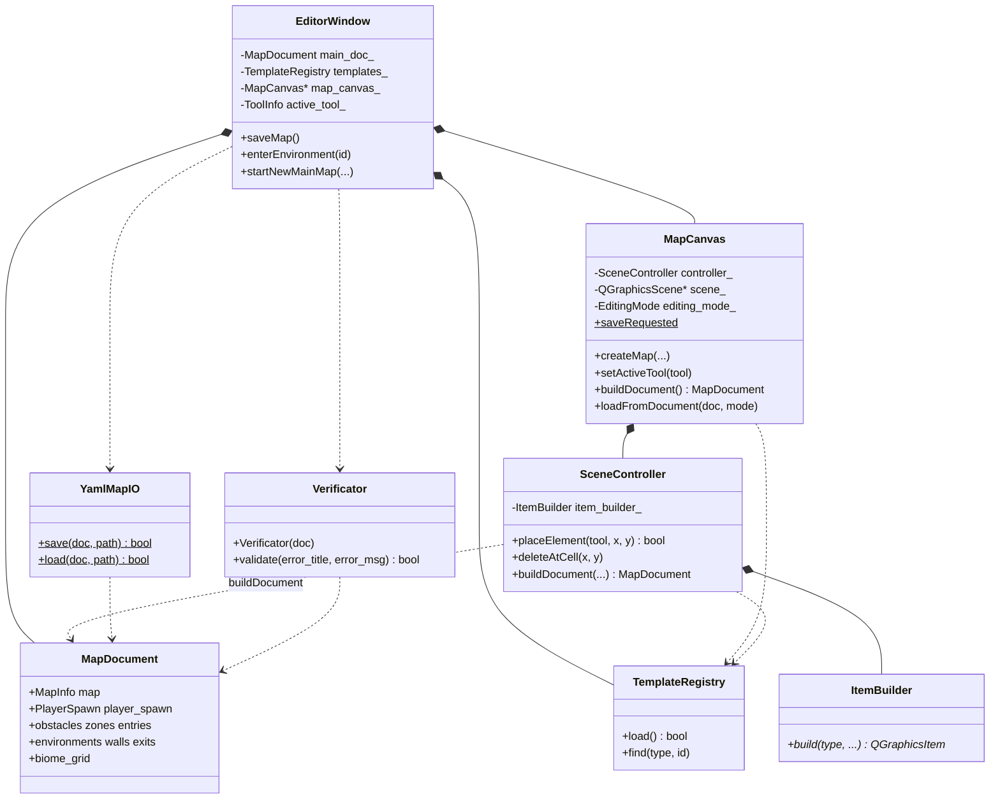

### Herramientas de edición

Cada herramienta es un `ToolInfo` (tipo + template). La ventana lo setea en el canvas cuando el usuario elige un botón del panel lateral.

| Herramienta | Qué coloca | Overworld o Environments |
|---|---|---|
| Player spawn | punto de aparición del jugador | ambos |
| Obstacle | obstáculo con textura | ambos |
| City zone | zona segura con NPCs y obstáculos fijos del template | overworld |
| Biome zone | zona de criaturas con textura de piso | overworld |
| Entry | entrada hacia un environment | overworld |
| Floor | tile de piso sobre el grid de biomas | overworld |
| Wall / Exit | paredes y salidas del environment | environments |

### Flujo completo de edición (simplificado)

Ejemplo de arranque, crear mapa, colocar un obstáculo y guardar:

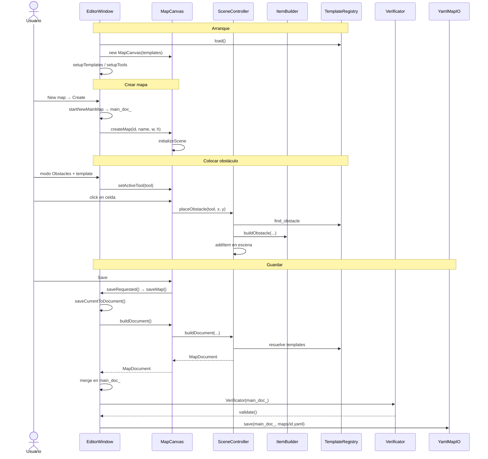

El editor guarda los mapas en `server/assets/maps/` como YAML. El servidor lee esos mismos archivos al arrancar con `YamlMapLoader`.

---

## Protocolo y comunicación

El protocolo es el lenguaje común que cliente y servidor hablan para
ponerse de acuerdo sobre lo que está pasando en el juego. Es
**binario**, viaja sobre **sockets TCP bloqueantes** y todos los
valores numéricos multi-byte se transmiten en **network byte order**
(big-endian).

Cada mensaje empieza con **un byte de opcode** seguido de los campos
específicos de ese tipo de mensaje. Los strings se prefijan por su
longitud en `uint16_t` (sin null-terminator). Los opcodes se reparten
en dos rangos disjuntos para que sea imposible confundir un mensaje
cliente→servidor con uno servidor→cliente:

- Mensajes **cliente → servidor**: `0x01` – `0x7F`.
- Mensajes **servidor → cliente**: `0x80` – `0xFF`.

### Módulo común

Las clases que implementan el protocolo viven en un módulo común que
consume tanto el cliente como el servidor. Tenerlo en un solo lugar
garantiza que ambos lados hablen el mismo idioma byte a byte. Cada
mensaje del protocolo es una clase propia que sabe cómo serializarse
y deserializarse, en lugar de un parser monolítico con un `switch`
sobre el opcode. Sumar un mensaje nuevo se reduce a definir su clase
y registrarla en la factory que despacha por opcode.

- **`Socket`**: TDA provisto por la cátedra, envuelve un socket POSIX
  con `sendall`, `recvall`, `shutdown` y `close`.
- **`CommonProtocol`**: envuelve un `Socket` y expone primitivas
  tipadas para enviar y recibir un byte, números de dos o cuatro
  bytes y mensajes (vector de bytes). Se ocupa de la conversión de
  endianness en los enteros multi-byte. Es la única clase que toca
  los bytes del wire.
- **`ClientEvent`** (clase abstracta): representa cualquier mensaje
  que el cliente le manda al servidor. Cada tipo concreto es una
  subclase con sus campos y su propia regla de serialización.
- **`ServerEvent`** (clase abstracta): análoga para los mensajes que
  el servidor le manda al cliente.
- **`Queue<T>`**: cola thread-safe genérica que intercambia mensajes
  entre los hilos de I/O y el resto del programa.

**Capas base.** `Socket`, `CommonProtocol` y `Queue<T>` son la base
sobre la que se construye el resto del protocolo.

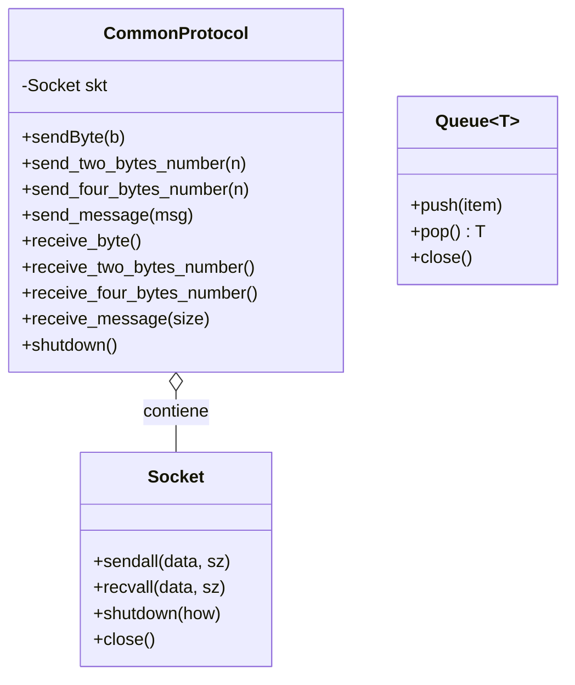

**Jerarquía de eventos.** Cada mensaje del protocolo es una subclase
de `ClientEvent` (mensajes hacia el servidor) o `ServerEvent`
(mensajes hacia el cliente). Ambas reciben un `CommonProtocol` en sus
métodos `serialize` y `deserialize`. Acá se muestran algunos eventos
representativos de cada jerarquía; la lista completa con sus opcodes
y campos está en la sección
[Mensajes del protocolo](#mensajes-del-protocolo).

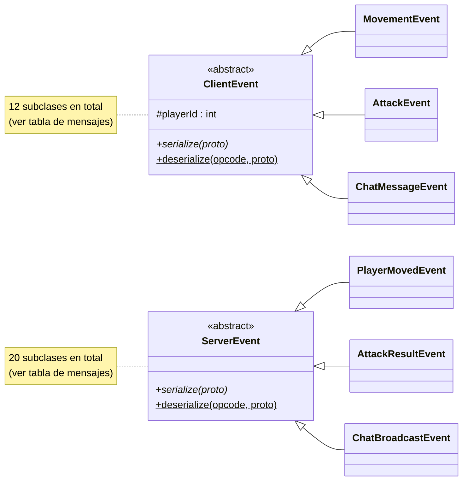

### Capa de comunicación del cliente

Del lado del cliente la comunicación se organiza en dos hilos
dedicados a I/O: uno para enviar y otro para recibir. El thread
principal de la aplicación gráfica nunca toca el socket.

- **`Client`**: orquesta el ciclo de vida. Abre la conexión al
  servidor, levanta los dos hilos y mantiene las dos colas de
  mensajes (entrante y saliente).
- **`ClientProtocol`**: envuelve un `CommonProtocol` con métodos
  tipados para enviar un `ClientEvent` y recibir un `ServerEvent`.
- **`ClientSender`**: hilo dedicado al envío. En un loop, toma el
  próximo evento de la cola saliente y lo serializa al socket.
- **`ClientReceiver`**: hilo dedicado a la recepción. En un loop,
  lee el opcode siguiente del socket, reconstruye el evento con la
  factory y lo encola en la cola entrante.

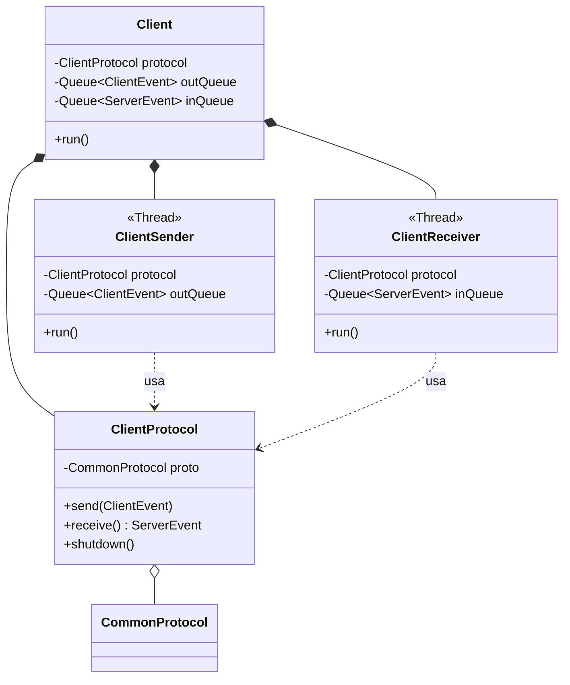

### Capa de comunicación del servidor

El servidor sigue un patrón similar pero multiplicado por la cantidad
de clientes conectados. Hay un hilo aceptador que escucha el socket
en modo pasivo y, por cada cliente que se conecta, levanta un
**handler** con su par de hilos de I/O.

- **`Acceptor`**: hilo único que mantiene el socket en modo pasivo.
  Por cada `accept()` exitoso crea un `ClientHandler` nuevo y lo
  registra en el monitor. También hace "reap" periódico de los
  handlers cuyo cliente se desconectó.
- **`ClientHandler`**: agrupa los recursos asociados a un cliente
  conectado: su `ServerProtocol`, su par de hilos y su cola de
  salida.
- **`ServerProtocol`**: la versión del lado del servidor del
  `ClientProtocol`.
- **`ServerSender`**: hilo por cliente que toma eventos de la cola de
  salida y los serializa al socket.
- **`ServerReceiver`**: hilo por cliente que lee mensajes del socket,
  les pone el `playerId` correspondiente y los encola en la cola de
  entrada compartida.
- **`ClientMonitor`**: la API que usa el game loop para mandarles
  cosas a los clientes. Mantiene un mapa de `playerId → cola de
  salida` y expone `sendToClient`, `broadcast` y `broadcastExcept`.

Con `N` clientes conectados, el servidor tiene **`2N + 2` hilos**:
dos por cliente (sender + receiver), uno para el game loop y uno
para el acceptor.

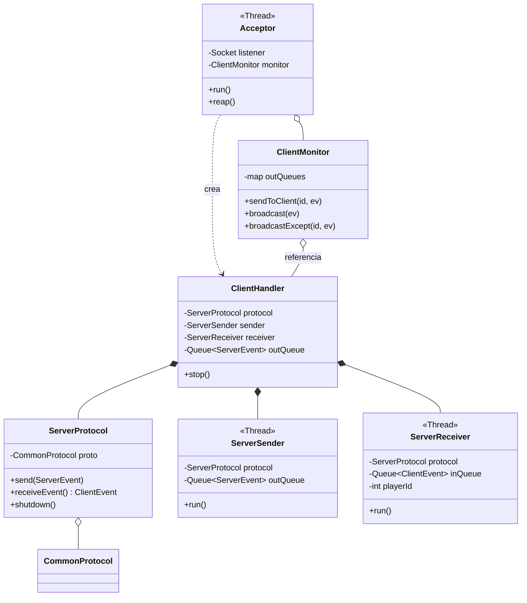

### Flujo de un mensaje cliente → servidor

Cuando el usuario aprieta una tecla, el evento atraviesa varias
capas hasta llegar al game loop del servidor. La conversión
"bytes ↔ objeto" sucede en el hilo del receiver, no le roba tiempo a
la lógica del juego.

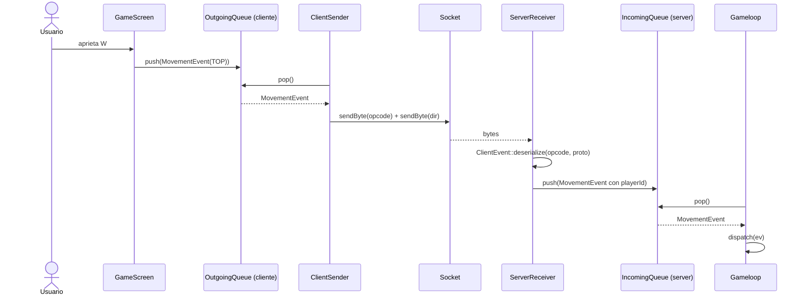

### Flujo de un mensaje servidor → cliente

Cuando el game loop decide que algo cambió, le delega el envío al
`ClientMonitor`. Si la novedad le importa a todos (un jugador se
movió, un NPC apareció) llama a `broadcast`. Si es específico de un
solo jugador (el resultado de su login) llama a `sendToClient`. El
evento se serializa una vez por cliente, en paralelo, en cada hilo
sender. Para no copiar los datos `N` veces, las colas guardan
`shared_ptr`.

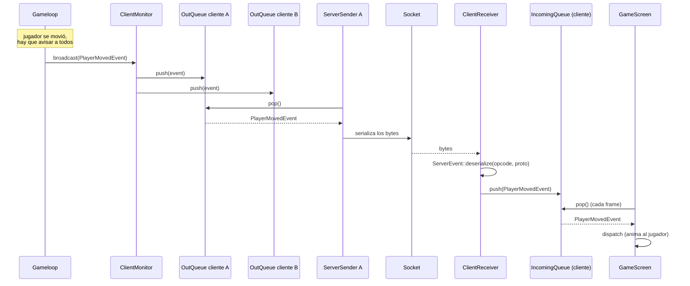

### Mensajes del protocolo

**Cliente → servidor (`0x01` – `0x7F`)**

| Opcode | Mensaje | Payload |
|---|---|---|
| `0x01` | `USER_ARRIVAL` | `[len:2][nombre]` |
| `0x02` | `MOVEMENT` | `[dir:1]` |
| `0x07` | `CHARACTER_CREATED` | `[raza:1][clase:1][head_id:1][skin_id:1]` |
| `0x08` | `TURN` | `[dir:1]` |
| `0x09` | `ATTACK` | `[target_type:1][target_id:2]` |
| `0x0D` | `PICK_UP_ITEM` | (sin payload) |
| `0x0E` | `DROP_ITEM` | `[inv_slot:1]` |
| `0x0F` | `EQUIP_ITEM` | `[inv_slot:1]` |
| `0x10` | `UNEQUIP_ITEM` | `[slot_type:1]` |
| `0x11` | `CHAT` | `[len:2][texto]` |
| `0x12` | `SELECT_NPC` | `[npc_id:2]` |

**Servidor → cliente (`0x80` – `0xFF`)**

| Opcode | Mensaje | Payload |
|---|---|---|
| `0x80` | `POSICION_JUGADORES` | snapshot de posiciones. |
| `0x81` | `STATS_JUGADOR` | vida, vida máx, mana, mana máx, oro, exp, exp del próximo nivel, nivel. |
| `0x82` | `CHAT_MSG` | `[author_id:2][name_len:2][name][msg_len:2][msg]`. `author_id = 0` indica mensaje del sistema. |
| `0x83` | `MAP` | dimensiones del mapa, todas las celdas y los obstáculos con textura custom. |
| `0x84` | `LOGIN_OK` | `[spawn_x:2][spawn_y:2][skin:1][head:1]`. |
| `0x85` | `LOGIN_FAIL` | (sin payload). |
| `0x87` | `MOVE_REJECTED` | `[x:2][y:2]` — posición autoritativa para reconciliar la predicción del cliente. |
| `0x88` | `NEW_PLAYER` | `[id:2][x:2][y:2][dir:1][skin:1][head:1][name_len:2][name]`. |
| `0x89` | `PLAYER_MOVED` | `[id:2][x:2][y:2][dir:1]`. |
| `0x8A` | `PLAYER_DISCONNECTED` | `[id:2]`. |
| `0x8B` | `FIRST_LOGIN` | (sin payload) — el cliente debe responder con `CHARACTER_CREATED`. |
| `0x8C` | `NPC_LIST` | snapshot de NPCs al entrar a un mapa. |
| `0x8D` | `DROPPED_ITEMS` | snapshot de items en el piso al entrar a un mapa. |
| `0x8E` | `ATTACK_RESULT` | `[attacker_id:2][target_type:1][target_id:2][damage:2][hit:1]`. |
| `0x8F` | `INVENTORY_UPDATE` | inventario completo del jugador local más los slots equipados. |
| `0x90` | `PLAYER_EQUIPPED` | `[player_id:2][slot:1][item_id:1]`. |
| `0x91` | `NEW_NPC` | `[id:2][x:2][y:2][type:1][alive:1]`. |
| `0x92` | `NPC_MOVED` | `[id:2][x:2][y:2][dir:1]`. |
| `0x93` | `NPC_DIED` | `[id:2]`. |
| `0x94` | `NPC_RESPAWNED` | `[id:2][x:2][y:2]`. |
| `0x95` | `PLAYER_DIED` | `[id:2]`. |
| `0x96` | `PLAYER_REVIVED` | `[id:2][x:2][y:2]`. |
| `0x97` | `ITEM_DROPPED` | `[drop_id:2][item_id:1][x:2][y:2][gold_amount:4]`. |
| `0x98` | `ITEM_PICKED_UP` | `[drop_id:2]`. |

### Cierre de conexiones y errores

El cierre limpio del cliente (`shutdown()` en su protocolo) hace que
la lectura bloqueante del servidor devuelva cero bytes; el receiver
interpreta esto como desconexión y libera los recursos. Si el socket
se rompe de manera inesperada, las operaciones sobre el socket
cerrado levantan una excepción que el sender o el receiver capturan
y el handler se marca como caído, para que el acceptor lo recolecte
en su próximo "reap". Al cerrar el servidor, el acceptor cierra el
socket de escucha (lo que hace que el `accept()` activo levante
excepción) y después cierra cada handler en orden, joineando ambos
hilos.

### Tests del protocolo

El protocolo está cubierto por una suite de tests unitarios escrita
en GoogleTest. Hay tres archivos: uno para las primitivas de
`CommonProtocol`, uno por cada lado de la jerarquía de eventos. Los
tests serializan un evento, lo reconstruyen del otro lado a través
de un par de sockets reales conectados en localhost (en una clase
auxiliar `ProtocolLoopback`), y verifican que todos los campos
sobrevivan el round-trip.
