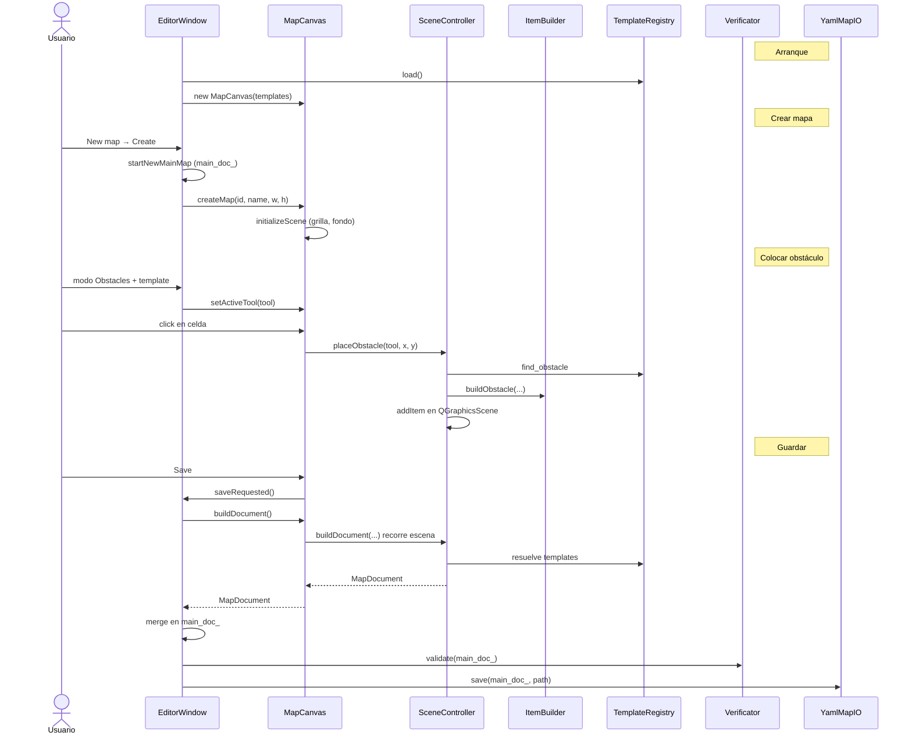
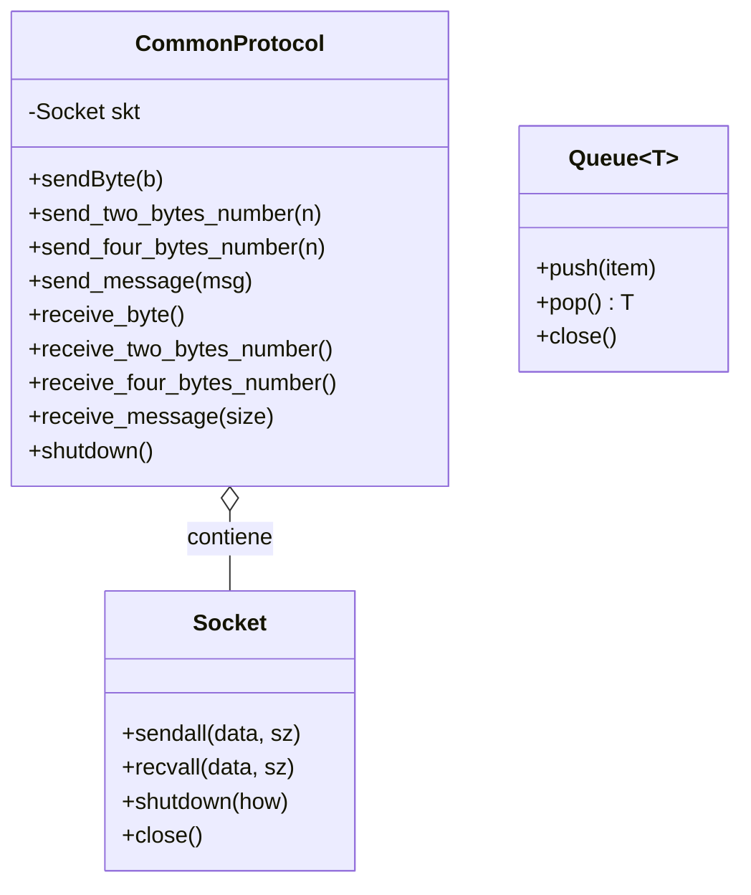
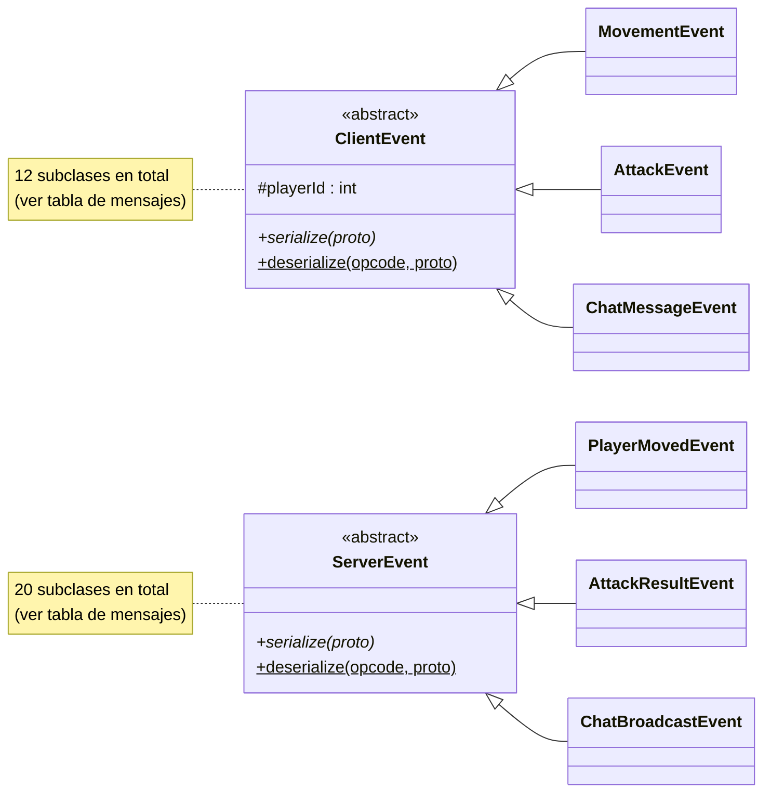
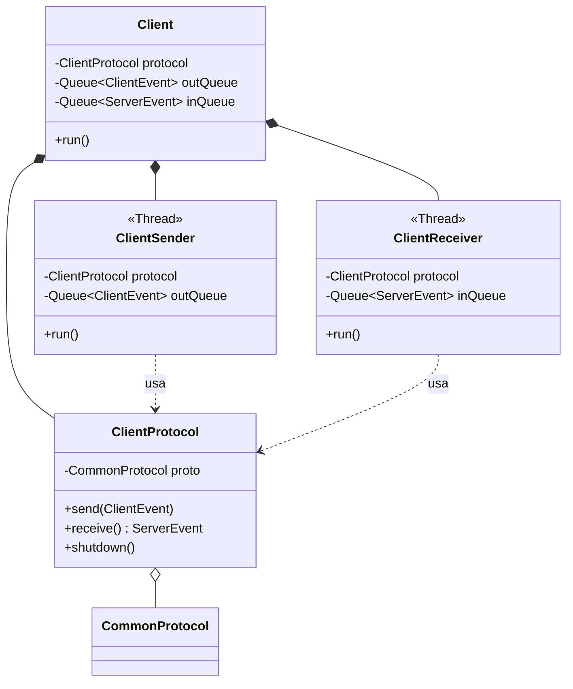
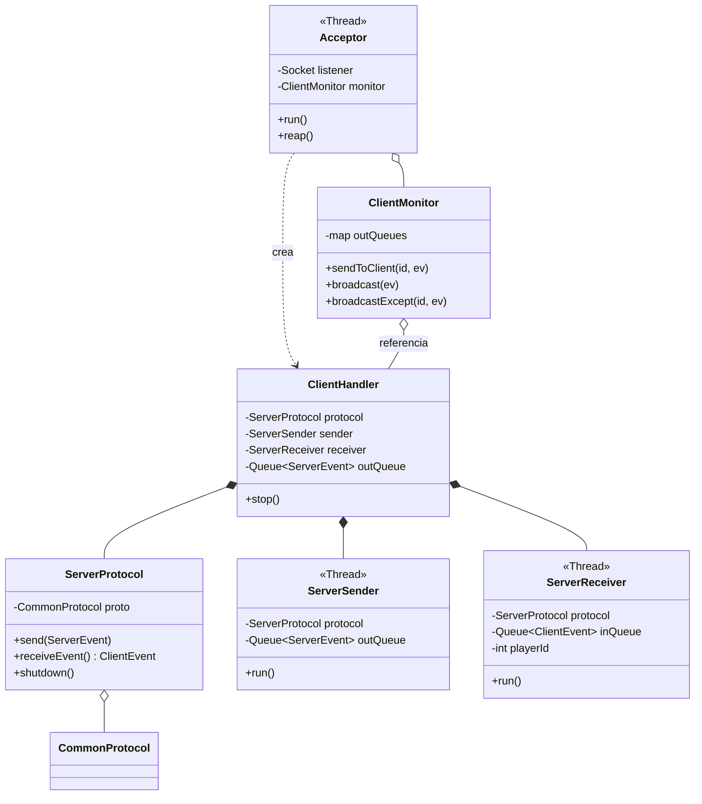
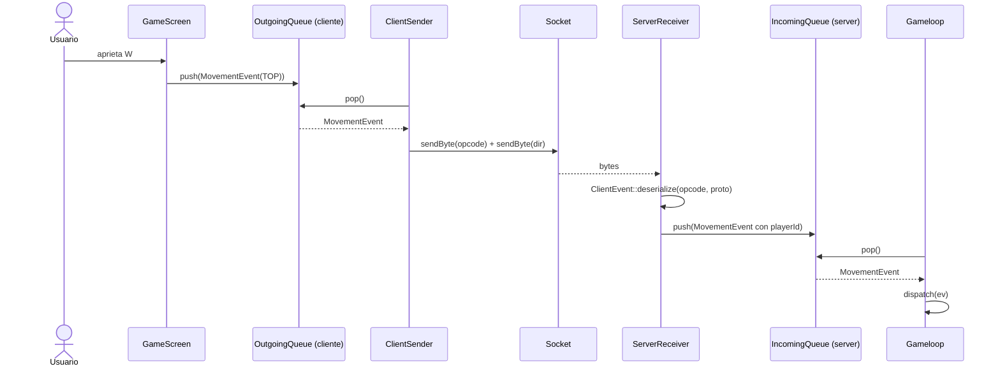
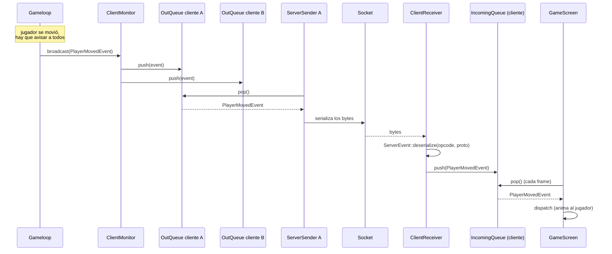

# Argentum Online — Documentación Técnica

**Taller de Programación I — FIUBA — 1er Cuatrimestre 2026 — Grupo 09**

Nicolás de la Torre, Oliver Weber, Joaquín Velurtas, Tomás Nahuel Olivera.

---

## Cliente

_(pendiente)_

## Servidor

_(pendiente)_

## Editor

El editor es la aplicacion que permite armar los mapas del juego y exportarlos como archivos YAML en `server/assets/maps/`, para que el servidor cargue con `YamlMapLoader` y se los mande al cliente.

### Organizacion

La UI se organiza en tres capas: la ventana principal maneja herramientas y navegación, el canvas captura el input y dibuja, y el controlador de escena concentra la lógica de colocar y borrar elementos. El modelo persistente de datos, `MapDocument`, vive en la ventana principal y solo se sincroniza con el canvas cuando hace falta (cambio de entorno, guardado o apertura de mapa).

### Componentes

- **`EditorWindow`**: ventana principal. Mantiene el `MapDocument` del mapa principal, la herramienta activa, la lista de environments y el flujo de pantallas. Crea el `MapCanvas`, carga los templates y conecta señales de la UI.
- **`MapCanvas`**: widget central de edición. Traduce clicks del mouse en acciones según la herramienta activa y el entorno de edición (`MainMap` o `Environment`).
- **`SceneController`**: lógica de colocación y borrado en la escena. Valida solapamientos, genera IDs, mantiene spawns de criaturas por zona y reconstruye un `MapDocument` a partir de los ítems gráficos.
- **`ItemBuilder`**: factory de items graficos. Separa cómo se ve un elemento de cómo se persiste en el documento.
- **`MapDocument`**: modelo en memoria del mapa completo.
- **`TemplateRegistry`**: lee los YAML de templates de ciudades, biomas, obstáculos, entradas, paredes, salidas, pisos y los expone al editor para poblar las listas de elementos.
- **`YamlMapIO`**: serializa y deserializa `MapDocument` ↔ YAML.
- **`Verificator`**: corre antes de guardar. Verifica que el mapa tenga id y dimensiones válidas, que exista un spawn del jugador en el overworld, que cada entrada apunte a un environment existente y que cada environment tenga tamaño válido, spawn del jugador y que las paredes encierren un área interior donde caiga el spawn.

### Herramientas de edición

Cada herramienta es un `ToolInfo` (tipo + template). La ventana principal lo setea en el canvas cuando el usuario elige un botón del panel lateral.

| Herramienta | Qué coloca | Overworld o Environments |
|---|---|---|
| Player spawn | punto de aparición del jugador | ambos |
| Obstacle | obstáculo con textura | ambos |
| City zone | zona segura con NPCs y obstáculos fijos del template | overworld |
| Biome zone | zona de criaturas con textura de piso | overworld |
| Entry | entrada hacia un environment | overworld |
| Floor | tile de piso sobre el grid de biomas | overworld |
| Wall / Exit | paredes y salidas del environment | environments |

En el mapa principal se editan biomas, ciudades, entradas, pisos y el pawn global. Al hacer doble click en un environment de la lista, el canvas carga un sub-documento y pasa a modo `Environment` para editar obstáculos, paredes, salidas, spawn interno y criaturas.

### Flujo completo de edición (simplificado)

Ejemplo de arranque, crear mapa, colocar un obstáculo y guardar:

### Relación con el servidor

El editor y el servidor leen el mismo esquema YAML pero con loaders distintos (`YamlMapIO` vs `YamlMapLoader`). El loader del servidor no reconstruye el mapa para editarlo: expande zonas, aplica obstáculos sobre celdas, resuelve spawns de criaturas y arma las entradas con punteros a los environments cargados. Ese `Map` es el que el game loop usa y el que el protocolo serializa hacia el cliente.

---

## Protocolo y comunicación

El protocolo es el lenguaje común que cliente y servidor hablan para
ponerse de acuerdo sobre lo que está pasando en el juego. Es
**binario**, viaja sobre **sockets TCP bloqueantes** y todos los
valores numéricos multi-byte se transmiten en **network byte order**
(big-endian).

Cada mensaje empieza con **un byte de opcode** seguido de los campos
específicos de ese tipo de mensaje. Los strings se prefijan por su
longitud en `uint16_t` (sin null-terminator). Los opcodes se reparten
en dos rangos disjuntos para que sea imposible confundir un mensaje
cliente→servidor con uno servidor→cliente:

- Mensajes **cliente → servidor**: `0x01` – `0x7F`.
- Mensajes **servidor → cliente**: `0x80` – `0xFF`.

### Módulo común

Las clases que implementan el protocolo viven en un módulo común que
consume tanto el cliente como el servidor. Tenerlo en un solo lugar
garantiza que ambos lados hablen el mismo idioma byte a byte. Cada
mensaje del protocolo es una clase propia que sabe cómo serializarse
y deserializarse, en lugar de un parser monolítico con un `switch`
sobre el opcode. Sumar un mensaje nuevo se reduce a definir su clase
y registrarla en la factory que despacha por opcode.

- **`Socket`**: TDA provisto por la cátedra, envuelve un socket POSIX
  con `sendall`, `recvall`, `shutdown` y `close`.
- **`CommonProtocol`**: envuelve un `Socket` y expone primitivas
  tipadas para enviar y recibir un byte, números de dos o cuatro
  bytes y mensajes (vector de bytes). Se ocupa de la conversión de
  endianness en los enteros multi-byte. Es la única clase que toca
  los bytes del wire.
- **`ClientEvent`** (clase abstracta): representa cualquier mensaje
  que el cliente le manda al servidor. Cada tipo concreto es una
  subclase con sus campos y su propia regla de serialización.
- **`ServerEvent`** (clase abstracta): análoga para los mensajes que
  el servidor le manda al cliente.
- **`Queue<T>`**: cola thread-safe genérica que intercambia mensajes
  entre los hilos de I/O y el resto del programa.

**Capas base.** `Socket`, `CommonProtocol` y `Queue<T>` son la base
sobre la que se construye el resto del protocolo.

**Jerarquía de eventos.** Cada mensaje del protocolo es una subclase
de `ClientEvent` (mensajes hacia el servidor) o `ServerEvent`
(mensajes hacia el cliente). Ambas reciben un `CommonProtocol` en sus
métodos `serialize` y `deserialize`. Acá se muestran algunos eventos
representativos de cada jerarquía; la lista completa con sus opcodes
y campos está en la sección
[Mensajes del protocolo](#mensajes-del-protocolo).

### Capa de comunicación del cliente

Del lado del cliente la comunicación se organiza en dos hilos
dedicados a I/O: uno para enviar y otro para recibir. El thread
principal de la aplicación gráfica nunca toca el socket.

- **`Client`**: orquesta el ciclo de vida. Abre la conexión al
  servidor, levanta los dos hilos y mantiene las dos colas de
  mensajes (entrante y saliente).
- **`ClientProtocol`**: envuelve un `CommonProtocol` con métodos
  tipados para enviar un `ClientEvent` y recibir un `ServerEvent`.
- **`ClientSender`**: hilo dedicado al envío. En un loop, toma el
  próximo evento de la cola saliente y lo serializa al socket.
- **`ClientReceiver`**: hilo dedicado a la recepción. En un loop,
  lee el opcode siguiente del socket, reconstruye el evento con la
  factory y lo encola en la cola entrante.

### Capa de comunicación del servidor

El servidor sigue un patrón similar pero multiplicado por la cantidad
de clientes conectados. Hay un hilo aceptador que escucha el socket
en modo pasivo y, por cada cliente que se conecta, levanta un
**handler** con su par de hilos de I/O.

- **`Acceptor`**: hilo único que mantiene el socket en modo pasivo.
  Por cada `accept()` exitoso crea un `ClientHandler` nuevo y lo
  registra en el monitor. También hace "reap" periódico de los
  handlers cuyo cliente se desconectó.
- **`ClientHandler`**: agrupa los recursos asociados a un cliente
  conectado: su `ServerProtocol`, su par de hilos y su cola de
  salida.
- **`ServerProtocol`**: la versión del lado del servidor del
  `ClientProtocol`.
- **`ServerSender`**: hilo por cliente que toma eventos de la cola de
  salida y los serializa al socket.
- **`ServerReceiver`**: hilo por cliente que lee mensajes del socket,
  les pone el `playerId` correspondiente y los encola en la cola de
  entrada compartida.
- **`ClientMonitor`**: la API que usa el game loop para mandarles
  cosas a los clientes. Mantiene un mapa de `playerId → cola de
  salida` y expone `sendToClient`, `broadcast` y `broadcastExcept`.

Con `N` clientes conectados, el servidor tiene **`2N + 2` hilos**:
dos por cliente (sender + receiver), uno para el game loop y uno
para el acceptor.

### Flujo de un mensaje cliente → servidor

Cuando el usuario aprieta una tecla, el evento atraviesa varias
capas hasta llegar al game loop del servidor. La conversión
"bytes ↔ objeto" sucede en el hilo del receiver, no le roba tiempo a
la lógica del juego.

### Flujo de un mensaje servidor → cliente

Cuando el game loop decide que algo cambió, le delega el envío al
`ClientMonitor`. Si la novedad le importa a todos (un jugador se
movió, un NPC apareció) llama a `broadcast`. Si es específico de un
solo jugador (el resultado de su login) llama a `sendToClient`. El
evento se serializa una vez por cliente, en paralelo, en cada hilo
sender. Para no copiar los datos `N` veces, las colas guardan
`shared_ptr`.

### Mensajes del protocolo

**Cliente → servidor (`0x01` – `0x7F`)**

| Opcode | Mensaje | Payload |
|---|---|---|
| `0x01` | `USER_ARRIVAL` | `[len:2][nombre]` |
| `0x02` | `MOVEMENT` | `[dir:1]` |
| `0x07` | `CHARACTER_CREATED` | `[raza:1][clase:1][head_id:1][skin_id:1]` |
| `0x08` | `TURN` | `[dir:1]` |
| `0x09` | `ATTACK` | `[target_type:1][target_id:2]` |
| `0x0D` | `PICK_UP_ITEM` | (sin payload) |
| `0x0E` | `DROP_ITEM` | `[inv_slot:1]` |
| `0x0F` | `EQUIP_ITEM` | `[inv_slot:1]` |
| `0x10` | `UNEQUIP_ITEM` | `[slot_type:1]` |
| `0x11` | `CHAT` | `[len:2][texto]` |
| `0x12` | `SELECT_NPC` | `[npc_id:2]` |

**Servidor → cliente (`0x80` – `0xFF`)**

| Opcode | Mensaje | Payload |
|---|---|---|
| `0x80` | `POSICION_JUGADORES` | snapshot de posiciones. |
| `0x81` | `STATS_JUGADOR` | vida, vida máx, mana, mana máx, oro, exp, exp del próximo nivel, nivel. |
| `0x82` | `CHAT_MSG` | `[author_id:2][name_len:2][name][msg_len:2][msg]`. `author_id = 0` indica mensaje del sistema. |
| `0x83` | `MAP` | dimensiones del mapa, todas las celdas y los obstáculos con textura custom. |
| `0x84` | `LOGIN_OK` | `[spawn_x:2][spawn_y:2][skin:1][head:1]`. |
| `0x85` | `LOGIN_FAIL` | (sin payload). |
| `0x87` | `MOVE_REJECTED` | `[x:2][y:2]` — posición autoritativa para reconciliar la predicción del cliente. |
| `0x88` | `NEW_PLAYER` | `[id:2][x:2][y:2][dir:1][skin:1][head:1][name_len:2][name]`. |
| `0x89` | `PLAYER_MOVED` | `[id:2][x:2][y:2][dir:1]`. |
| `0x8A` | `PLAYER_DISCONNECTED` | `[id:2]`. |
| `0x8B` | `FIRST_LOGIN` | (sin payload) — el cliente debe responder con `CHARACTER_CREATED`. |
| `0x8C` | `NPC_LIST` | snapshot de NPCs al entrar a un mapa. |
| `0x8D` | `DROPPED_ITEMS` | snapshot de items en el piso al entrar a un mapa. |
| `0x8E` | `ATTACK_RESULT` | `[attacker_id:2][target_type:1][target_id:2][damage:2][hit:1]`. |
| `0x8F` | `INVENTORY_UPDATE` | inventario completo del jugador local más los slots equipados. |
| `0x90` | `PLAYER_EQUIPPED` | `[player_id:2][slot:1][item_id:1]`. |
| `0x91` | `NEW_NPC` | `[id:2][x:2][y:2][type:1][alive:1]`. |
| `0x92` | `NPC_MOVED` | `[id:2][x:2][y:2][dir:1]`. |
| `0x93` | `NPC_DIED` | `[id:2]`. |
| `0x94` | `NPC_RESPAWNED` | `[id:2][x:2][y:2]`. |
| `0x95` | `PLAYER_DIED` | `[id:2]`. |
| `0x96` | `PLAYER_REVIVED` | `[id:2][x:2][y:2]`. |
| `0x97` | `ITEM_DROPPED` | `[drop_id:2][item_id:1][x:2][y:2][gold_amount:4]`. |
| `0x98` | `ITEM_PICKED_UP` | `[drop_id:2]`. |

### Cierre de conexiones y errores

El cierre limpio del cliente (`shutdown()` en su protocolo) hace que
la lectura bloqueante del servidor devuelva cero bytes; el receiver
interpreta esto como desconexión y libera los recursos. Si el socket
se rompe de manera inesperada, las operaciones sobre el socket
cerrado levantan una excepción que el sender o el receiver capturan
y el handler se marca como caído, para que el acceptor lo recolecte
en su próximo "reap". Al cerrar el servidor, el acceptor cierra el
socket de escucha (lo que hace que el `accept()` activo levante
excepción) y después cierra cada handler en orden, joineando ambos
hilos.

### Tests del protocolo

El protocolo está cubierto por una suite de tests unitarios escrita
en GoogleTest. Hay tres archivos: uno para las primitivas de
`CommonProtocol`, uno por cada lado de la jerarquía de eventos. Los
tests serializan un evento, lo reconstruyen del otro lado a través
de un par de sockets reales conectados en localhost (en una clase
auxiliar `ProtocolLoopback`), y verifican que todos los campos
sobrevivan el round-trip.
