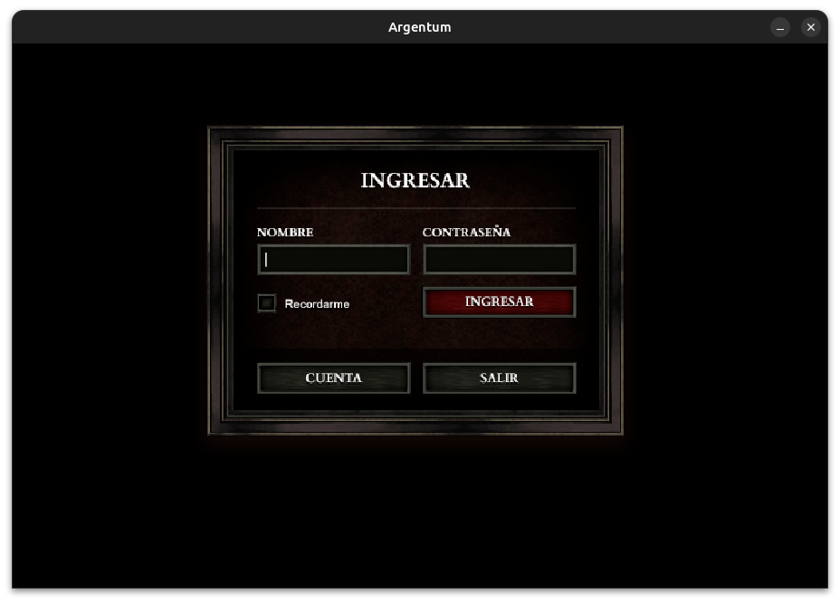
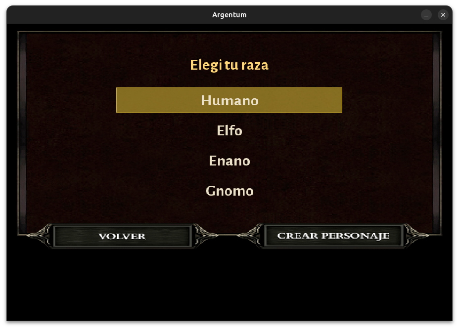
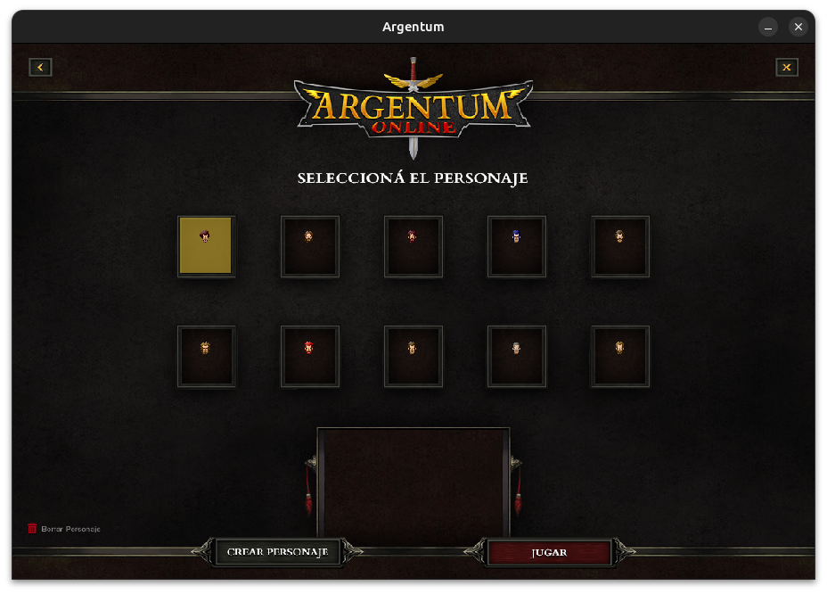
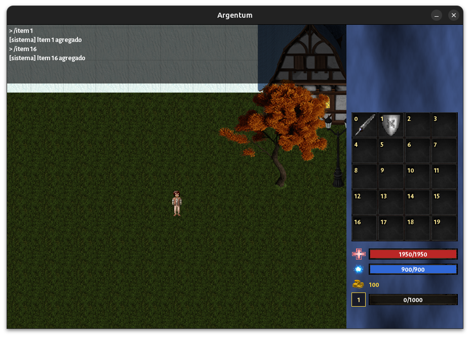

# 🛡️⚔️ Argentum Online — Remake · Manual del Usuario ⚔️🛡️

Bienvenido/a a **Argentum Online Remake**, un MMORPG 2D cliente-servidor desarrollado
en C++. Con las explicaciones paso a paso vas a poder **instalar, compilar, configurar y jugar** sin conocimientos previos de programación.

El proyecto incluye tres programas:

| Programa | Para qué sirve |
|----------|----------------|
| **Servidor** (`taller_server`) | Hostea la partida. Tiene que estar prendido para poder jugar. |
| **Cliente** (`taller_client`) | El juego en sí. Cada jugador abre un cliente y se conecta al servidor. |
| **Editor** (`taller_editor`) | Herramienta gráfica para crear y editar mapas (niveles). |

---

## Índice

1. [Requisitos del sistema](#1-requisitos-del-sistema)
2. [Instalación (la forma fácil)](#2-instalación-la-forma-fácil)
4. [Configuración: mapas, recursos y archivos](#4-configuración-mapas-recursos-y-archivos)
5. [Cómo levantar el servidor](#5-cómo-levantar-el-servidor)
6. [Cómo lanzar el cliente](#6-cómo-lanzar-el-cliente)
7. [Cómo se juega](#7-cómo-se-juega)
8. [Comandos de chat](#8-comandos-de-chat)
9. [Cómo crear y editar mapas con el Editor](#9-cómo-crear-y-editar-mapas-con-el-editor)

---

## 1. Requisitos del sistema

| Requisito | Detalle |
|-----------|---------|
| **Sistema operativo** | Ubuntu 24.04 / Xubuntu 24.04 (cualquier distro basada en Debian/Ubuntu con `apt`). |
| **Compilador** | `g++` con soporte de **C++20** (incluido en `build-essential`). |
| **CMake** | Versión **3.24 o superior** (el instalador la actualiza automáticamente si hace falta). |
| **Dependencias gráficas/audio** | SDL2, SDL2_image, SDL2_mixer, SDL2_ttf (se compilan solas desde fuente). |
| **Editor de mapas** | Qt 6 (`qt6-base-dev`). |
| **Otras librerías** | yaml-cpp, Box2D, GoogleTest, librerías de audio (opus, fluidsynth, etc.). |

> 💡 **No te preocupes por instalar todo esto a mano.** El instalador
> (`install.sh` / `make install`) se encarga de descargar e instalar todas las
> dependencias por vos. La tabla está acá solo a modo informativo.

---

## 2. Instalación (la forma fácil)

Esta es la forma **recomendada**. Sólo necesitás dos pasos.

### Paso 1 — Clonar el repositorio

Abrí una terminal y ejecutá:

```sh
git clone <URL_DEL_REPO>
cd TP_Grupal_Grupo_09_Argentum
```

### Paso 2 — Correr el instalador

```sh
sudo ./install.sh
```

Esto va a:

1. Actualizar el índice de paquetes (`apt-get update`).
2. Instalar **todas** las dependencias del sistema.
3. Verificar la versión de CMake y, si es vieja, actualizarla desde el repositorio oficial de Kitware.
4. **Compilar el proyecto** automáticamente.

Cuando termine vas a ver el mensaje:

```
>>> Compilacion finalizada. Binarios en ./build/
```

A partir de ahí ya tenés los tres ejecutables listos en la carpeta `build/`:

```
build/taller_server
build/taller_client
build/taller_editor
```


## 3. Configuración: mapas, recursos y archivos

La buena noticia: **no hay que editar ningún archivo de configuración a mano para
jugar.** Los recursos (imágenes, sonidos, fuentes) ya vienen en el repositorio y los
programas los encuentran solos, porque al arrancar se posicionan automáticamente en
la raíz del proyecto.

Lo que conviene saber:

- **Imágenes y sprites**: están en `AO_IMGS/` y `common/assets/images/`. No hace
  falta moverlas a ningún lado.
- **Sonidos**: el cliente carga su audio desde la carpeta `client/Audio/`.
- **Mapas del servidor**: están en `server/assets/maps/` como archivos `.yaml`
  (`argentumland.yaml`, `completo.yaml`, etc.).
- **Mapa que carga el servidor**: por defecto el servidor levanta
  `server/assets/maps/argentumland.yaml`. Si querés que cargue otro mapa, podés
  renombrar tu mapa a `argentumland.yaml` (hacé una copia de seguridad del original
  primero), o usar el [Editor](#9-cómo-crear-y-editar-mapas-con-el-editor) para
  guardar tu mapa con ese nombre.

---

## 4. Cómo levantar el servidor

El servidor tiene que estar **prendido antes** de que se conecten los clientes.
Desde la raíz del proyecto, ejecutá:

```sh
./build/taller_server <PUERTO>
```

Por ejemplo, usando el puerto `8080`:

```sh
./build/taller_server 8080
```

- `<PUERTO>` es el número de puerto donde el servidor va a escuchar conexiones.
- La terminal queda "ocupada" mostrando los mensajes del servidor. **Dejala
  abierta** mientras jugás.
- Para apagar el servidor, en la consola del servidor con el comando 'q' se cierra.

> ⚠️ Anotá el puerto que elegiste: lo vas a necesitar para conectar cada cliente.

---

## 5. Cómo lanzar el cliente

Con el servidor ya corriendo, abrí **otra terminal** (o pedile a cada jugador que
abra la suya) y ejecutá:

```sh
./build/taller_client <HOST> <PUERTO>
```

- `<HOST>`: la dirección del servidor.
  - Si el servidor corre en **tu misma computadora**, usá `localhost`.
  - Si corre en **otra máquina de la red**, usá su dirección IP (por ejemplo `192.168.0.15`).
- `<PUERTO>`: **el mismo puerto** que pusiste al levantar el servidor.

Ejemplo (servidor y cliente en la misma máquina, puerto 8080):

```sh
./build/taller_client localhost 8080
```

### Modo pantalla completa (opcional)

Agregá `--fullscreen` al final para abrir el juego en pantalla completa:

```sh
./build/taller_client localhost 8080 --fullscreen
```

Podés abrir **varios clientes a la vez** (cada uno en su terminal) para jugar entre
varias personas contra el mismo servidor.

---

## 6. Cómo se juega

### 6.1 Pantalla de inicio de sesión

Al abrir el cliente vas a ver la pantalla de login. Escribí el **nombre de tu
personaje** y presioná `Enter`.



### 6.2 Elegí tu raza

A continuación elegís la **raza** de tu personaje. Usá las flechas o el mouse para
moverte entre las opciones y `Enter` para confirmar.

Razas disponibles: **Humano**, **Elfo**, **Enano**, **Gnomo**.



### 6.3 Elegí tu clase

Después elegís la **clase**, que define tu estilo de juego (más fuerza física o más
poder mágico).

Clases disponibles: **Mago**, **Clérigo**, **Campeón**, **Guerrero**.


### 6.4 Elegí la cabeza (aspecto)

Por último elegís el aspecto (cabeza) de tu personaje y entrás al mundo.



### 6.5 La pantalla de juego (HUD)

Una vez dentro, en el panel lateral derecho vas a ver la información de tu personaje:

- 🟥 **Barra de vida (HP)** — si llega a cero, morís.
- 🟦 **Barra de maná (MP)** — se consume al usar magia.
- 🟡 **Oro** — tu dinero para comprar y vender.
- ⭐ **Experiencia y nivel** — subís de nivel acumulando experiencia.
- 🎒 **Inventario** — los objetos que tenés encima.



### 6.6 Controles

| Acción | Control |
|--------|---------|
| **Moverse** | Teclas `W` `A` `S` `D` **o** las flechas ⬆️⬇️⬅️➡️ |
| **Atacar a un enemigo o jugador** | **Clic izquierdo** sobre el enemigo/jugador objetivo |
| **Hablar con un NPC amigo** (comerciante, banquero, sacerdote) | **Clic izquierdo** sobre el NPC para seleccionarlo |
| **Equipar / desequipar un objeto** | **Doble clic izquierdo** sobre el objeto en el inventario |
| **Abrir el chat / enviar mensaje** | `Enter` |
| **Cancelar el chat** | `Escape` |
| **Borrar texto en el chat** | `Backspace` |

> 💬 El **chat** sirve tanto para hablar con otros jugadores como para escribir
> **comandos** (ver la sección siguiente). Mientras el chat está abierto, las teclas
> de movimiento no mueven al personaje.

### 6.7 Combatir, comerciar y banco

- **Atacar**: hacé clic sobre un enemigo. El servidor valida si tenés el arma
  adecuada, si estás a distancia (ataque a distancia) o pegado (cuerpo a cuerpo).
- **Comerciar**: acercate a un **comerciante**, hacé clic para seleccionarlo y usá
  los comandos `/listar`, `/comprar` y `/vender`.
- **Sacerdote**: te cura (`/curar`) o te resucita (`/resucitar`) si moriste.
- **Banquero**: te guarda oro y objetos con `/depositar` y `/retirar`.
- **Recoger objetos del suelo**: parate sobre el objeto y usá `/tomar`.

Si morís, soltás tu equipamiento en el suelo y te convertís en fantasma; buscá un
**sacerdote** y usá `/resucitar`.

---

## 7. Comandos de chat

Abrí el chat con `Enter`, escribí el comando y presioná `Enter` de nuevo para
enviarlo.

### Objetos e inventario

| Comando | Qué hace |
|---------|----------|
| `/tomar` | Levanta el objeto que esté en tu celda. |
| `/tirar <slot>` | Tira al suelo el objeto del slot indicado del inventario. |
| `/equipar <slot>` | Equipa el objeto del slot indicado. |
| `/desequipar <arma\|armor\|casco\|escudo>` | Desequipa la pieza indicada. |
| `/meditar` | Recupera maná meditando (clases mágicas). |

### Comerciante / Sacerdote (requiere tenerlo seleccionado y estar cerca)

| Comando | Qué hace |
|---------|----------|
| `/listar` | Muestra el inventario del comerciante o del banco. |
| `/comprar <objeto>` | Compra un objeto al comerciante o sacerdote. |
| `/vender <objeto>` | Vende un objeto al comerciante. |
| `/curar` | El sacerdote te cura. |
| `/resucitar` | El sacerdote te revive si moriste. |

### Banquero (requiere tenerlo seleccionado y estar cerca)

| Comando | Qué hace |
|---------|----------|
| `/depositar <objeto>` | Deposita un objeto en el banco. |
| `/depositar oro <cant>` | Deposita oro en el banco. |
| `/retirar <objeto>` | Retira un objeto del banco. |
| `/retirar oro <cant>` | Retira oro del banco. |

### Clanes

| Comando | Qué hace |
|---------|----------|
| `/fundar-clan <nombre>` | Funda un clan nuevo. |
| `/unirse <nombre del clan>` | Pide unirte a un clan. |
| `/revisar-clan` | Revisa las solicitudes pendientes (fundador). |
| `/clan-aceptar <nick>` | Acepta a un solicitante. |
| `/clan-rechazar <nick>` | Rechaza a un solicitante. |
| `/clan-kick <nick>` | Expulsa a un miembro. |
| `/clan-ban <nick>` | Banea a un miembro. |
| `/dejar-clan` | Salís del clan. |

### Comandos de prueba (cheats)

Útiles para probar el juego rápidamente:

| Comando | Qué hace |
|---------|----------|
| `/vidainf` | Activa/desactiva vida infinita. |
| `/manainf` | Activa/desactiva maná infinito. |
| `/levelup` | Subís un nivel. |
| `/gold <cantidad>` | Te da oro. |
| `/item <itemId>` | Te da el objeto con ese id. |
| `/suicidio` | Tu personaje muere (para probar la mecánica de muerte). |

---

## 8. Cómo crear y editar mapas con el Editor

El editor es una aplicación gráfica (Qt) para diseñar los mapas donde se juega.

### 8.1 Abrir el editor

```sh
./build/taller_editor
```

### 8.2 Menú principal

Al abrir vas a ver dos opciones:

- **Nuevo mapa** (`Nuevo`): creás un mapa desde cero. Te pide un **id/nombre** y las
  **dimensiones** (ancho y alto en celdas).
- **Abrir mapa** (`Abrir`): te deja elegir un `.yaml` existente de
  `server/assets/maps/` para seguir editándolo.

### 8.3 Herramientas de edición

El editor trabaja por **modos**. Elegís un modo en la barra de herramientas y luego
pintás sobre el mapa haciendo clic en las celdas:

| Modo | Para qué sirve |
|------|----------------|
| **Spawn** | Define dónde aparecen los jugadores al entrar. |
| **Pisos (Floors)** | Pinta el terreno base (pasto, arena, tierra, agua, etc.). |
| **Biomas (Biomes)** | Zonas con su ambiente y criaturas que aparecen (spawns). |
| **Obstáculos (Obstacles)** | Rocas, árboles, cactus y demás elementos que bloquean el paso. |
| **Ciudades (Cities)** | Coloca edificios y estructuras (iglesia, banco, herrería…). |
| **Ambientes (Environments)** | Decoración y criaturas de ambiente. |
| **Salidas (Exits)** | Puntos de transición/salida del mapa. |
| **Dimensiones (Dimensions)** | Agranda o achica el mapa (expandir/encoger hacia arriba, abajo, izquierda o derecha). |

### 8.4 Guardar el mapa

Cuando guardás, el editor escribe el archivo `.yaml` en `server/assets/maps/` con el
nombre/id que le pusiste al mapa, y te muestra un mensaje con la ruta exacta donde
quedó guardado.

> 🎮 **Para jugar tu mapa**: recordá que el servidor carga por defecto
> `server/assets/maps/argentumland.yaml`. Guardá tu mapa con ese id (o renombrá el
> archivo) para que el servidor lo levante la próxima vez que lo inicies.

---